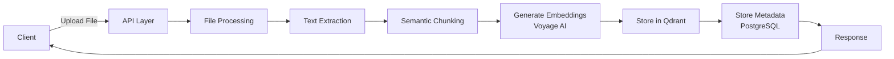
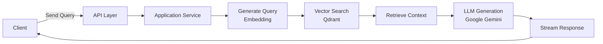
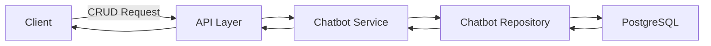

# Agentic RAG Sample - Architecture Documentation

## Project Overview

**Agentic RAG Sample** is a Retrieval-Augmented Generation (RAG) system with agentic capabilities for in-house chatbot applications. The system follows **Clean Architecture** principles to ensure maintainability, testability, and separation of concerns.

## Key Features

- 🇯🇵 **Japanese Document Processing**: Semantic chunking optimized for Japanese text
- 🚀 **Voyage AI 3.5 Embeddings**: State-of-the-art text embeddings
- 🗄️ **Qdrant Vector Storage**: Docker-containerized vector database with similarity search
- 📄 **Multi-format Support**: PDF, Word, Excel, text, images, and more
- 💬 **Conversational AI**: Chat with documents using Google Gemini 2.5 Flash-Lite
- 🔄 **Streaming Responses**: Real-time response streaming for better UX
- 🔧 **RESTful API**: Clean API design with comprehensive documentation
- 🦊 **GitLab Integration**: Ingest and search code from GitLab repositories
- 🌳 **AST-based Code Chunking**: Semantic analysis for Python, JavaScript, TypeScript, PHP

## Technology Stack

### Core Technologies
- **Python 3.12+**: Programming language
- **FastAPI**: Web framework for building APIs
- **uv**: Modern Python package manager
- **SQLAlchemy 2.0**: ORM for database interactions
- **Alembic**: Database migration tool
- **Pydantic**: Data validation using Python type hints

### AI/ML Stack
- **LangChain**: Framework for LLM applications
- **Google Gemini**: Large language models (2.0-flash-exp, 1.5-pro, 1.5-flash)
- **Voyage AI**: Text embedding models (voyage-3.5)
- **Qdrant**: Vector database for semantic search

### Data Storage
- **PostgreSQL 15**: Relational database for structured data
- **Qdrant**: Vector database for embeddings and similarity search

### DevOps
- **Docker & Docker Compose**: Containerization and service orchestration
- **pytest**: Testing framework
- **pgAdmin**: PostgreSQL administration tool

## Architecture Layers

The project follows Clean Architecture with clear separation of concerns:

```
app/
├── api/                    # Presentation Layer (HTTP Interface)
├── application/            # Application Layer (Use Cases)
├── domain/                 # Domain Layer (Business Logic)
├── infrastructure/         # Infrastructure Layer (External Services)
├── connectors/            # External System Connectors
├── config.py              # Configuration Management
└── main.py                # Application Entry Point
```

### 1. Domain Layer (`app/domain/`)

Pure business logic with no external dependencies. Contains:

- **Entities**: Core business objects (dataclasses)
- **Ports**: Repository interfaces (abstract base classes)

#### Structure:
```
domain/
├── chat/
│   └── models.py          # Chat-related domain models
├── chatbot/
│   ├── entities.py        # Chatbot entity
│   └── ports.py           # Chatbot repository interface
└── files/
    └── entities.py        # File ingestion entities
```

**Key Principles:**
- No framework dependencies
- Pure Python dataclasses for entities
- Abstract interfaces for data access (ports)
- Contains core business rules

### 2. Application Layer (`app/application/`)

Orchestrates domain objects and coordinates application workflows.

#### Structure:
```
application/
├── chatbot/
│   └── service.py         # Chatbot management use cases
└── rag/
    └── service.py         # RAG pipeline orchestration
```

**Responsibilities:**
- Implement use cases and business workflows
- Coordinate between domain and infrastructure
- Handle application-specific logic
- Dependency injection point for repositories

### 3. Infrastructure Layer (`app/infrastructure/`)

Implements technical capabilities and external integrations.

#### Structure:
```
infrastructure/
├── database/
│   ├── database.py        # Database connection and session management
│   ├── models.py          # SQLAlchemy ORM models
│   ├── repository.py      # Generic repository implementation
│   └── chatbot_repository.py  # Chatbot-specific repository
├── embeddings.py          # Voyage AI embedding service
├── ast_splitter.py        # AST-based code chunking
└── langchain/             # LangChain integrations (if any)
```

**Responsibilities:**
- Database access (PostgreSQL via SQLAlchemy)
- Vector database operations (Qdrant)
- External API integrations (Voyage AI, Google Gemini)
- File processing and document parsing
- Repository pattern implementations

### 4. API Layer (`app/api/`)

HTTP interface exposing the application to external clients.

#### Structure:
```
api/
├── deps.py                # Dependency injection for FastAPI
├── routes_chat.py         # Chat endpoints
├── routes_chatbot.py      # Chatbot management endpoints
└── routes_files.py        # File ingestion endpoints
```

**Endpoints:**

| Endpoint | Method | Description |
|----------|--------|-------------|
| `/chat` | POST | Q&A with document retrieval |
| `/chat/stream` | POST | Streaming chat responses |
| `/chatbots` | GET, POST | List/create chatbots |
| `/chatbots/{id}` | GET, PUT, DELETE | Get/update/delete chatbot |
| `/files/upload` | POST | Upload and ingest documents |
| `/files/ingest-gitlab-code` | POST | Ingest code from GitLab |
| `/files/collections` | GET | List collections |
| `/files/collections/{name}/stats` | GET | Get collection statistics |

### 5. Connectors (`app/connectors/`)

External system integrations.

```
connectors/
└── gitlab/
    └── connector.py       # GitLab API integration
```

## Data Flow

### Document Ingestion Flow



### Chat/Query Flow



### Chatbot Configuration Flow



## Database Schema

### PostgreSQL Tables

#### `chatbots`
Stores chatbot configurations.

| Column | Type | Description |
|--------|------|-------------|
| id | INTEGER | Primary key |
| name | VARCHAR | Chatbot name |
| description | TEXT | Description |
| system_prompt | TEXT | System instructions for the LLM |
| model | VARCHAR | LLM model name (e.g., gemini-2.0-flash-exp) |
| temperature | FLOAT | Response randomness (0.0-1.0) |
| max_tokens | INTEGER | Maximum response length |
| qdrant_collection | VARCHAR | Associated Qdrant collection |
| top_k | INTEGER | Number of documents to retrieve |
| threshold | FLOAT | Minimum similarity score |
| created_at | TIMESTAMP | Creation timestamp |
| updated_at | TIMESTAMP | Last update timestamp |

### Qdrant Collections

Vector embeddings are stored in Qdrant collections with:
- **Vector dimension**: 1536 (Voyage AI 3.5)
- **Distance metric**: Cosine similarity
- **Metadata**: Document source, chunk text, timestamps

## Configuration

Configuration is managed via Pydantic Settings from environment variables.

### Environment Variables

```bash
# Database
POSTGRES_DB=agentic_rag
POSTGRES_USER=postgres
POSTGRES_PASSWORD=your_password
DATABASE_HOST=localhost
DATABASE_PORT=5432

# Qdrant
QDRANT_HOST=localhost
QDRANT_PORT=6333
QDRANT_API_KEY=  # Optional

# AI Services
VOYAGE_API_KEY=your_voyage_key
GOOGLE_API_KEY=your_gemini_key

# GitLab (Optional)
GITLAB_TOKEN=your_gitlab_token
GITLAB_PROJECT_ID=your_project_id

# Application
LOG_LEVEL=INFO
LOG_FILE_PATH=logs/app.log
```

## Docker Services

### Qdrant
- **Image**: `qdrant/qdrant:latest`
- **Ports**: 6333 (HTTP), 6334 (gRPC)
- **Dashboard**: http://localhost:6333/dashboard

### PostgreSQL
- **Image**: `postgres:15-alpine`
- **Port**: 5432
- **Database**: `agentic_rag`

### pgAdmin
- **Image**: `dpage/pgadmin4:latest`
- **Port**: 5050
- **Web UI**: http://localhost:5050

## Design Patterns

### 1. Repository Pattern
Abstracts data access logic from business logic.

```python
# Port (Interface) in domain layer
class ChatbotRepositoryPort(ABC):
    @abstractmethod
    async def create(self, chatbot: ChatbotEntity) -> ChatbotEntity:
        pass

# Implementation in infrastructure layer
class ChatbotRepository(ChatbotRepositoryPort):
    def __init__(self, session: AsyncSession):
        self.session = session
    
    async def create(self, chatbot: ChatbotEntity) -> ChatbotEntity:
        # SQLAlchemy implementation
        ...
```

### 2. Dependency Injection
FastAPI's dependency system for loose coupling.

```python
# deps.py
async def get_database_session():
    async with get_session() as session:
        yield session

# routes.py
@router.post("/")
async def create_chatbot(
    session = Depends(get_database_session)
):
    repository = ChatbotRepository(session)
    service = ChatbotService(repository)
    ...
```

### 3. Service Layer Pattern
Encapsulates business logic in application services.

```python
class ChatbotService:
    def __init__(self, repository: ChatbotRepositoryPort):
        self.repository = repository
    
    async def create_chatbot(self, data: dict) -> ChatbotEntity:
        # Business logic here
        chatbot = ChatbotEntity(**data)
        return await self.repository.create(chatbot)
```

## Testing Strategy

### Test Structure
```
tests/
├── test_chatbot_api.py    # API integration tests
├── test_domain/           # Domain logic tests
├── test_application/      # Service layer tests
└── test_infrastructure/   # Repository tests
```

### Running Tests
```bash
# All tests
uv run pytest

# With coverage
uv run pytest --cov=app --cov-report=html

# Specific test file
uv run pytest tests/test_chatbot_api.py
```

## Development Workflow

### 1. Setup
```bash
# Install dependencies
uv sync

# Start Docker services
docker-compose up -d

# Run migrations
uv run alembic upgrade head
```

### 2. Development
```bash
# Start dev server with hot-reload
uv run python -m uvicorn app.main:app --reload --host 0.0.0.0 --port 8000
```

### 3. Database Changes
```bash
# Create migration
uv run alembic revision --autogenerate -m "description"

# Apply migration
uv run alembic upgrade head
```

### 4. Testing
```bash
# Run tests
uv run pytest

# Run with coverage
uv run pytest --cov=app
```

## Code Organization Best Practices

### 1. Import Order
```python
# Standard library
import os
from typing import List, Optional

# Third-party
from fastapi import APIRouter, Depends
from sqlalchemy import Column, Integer

# Local application
from app.domain.entities import ChatbotEntity
from app.application.service import ChatbotService
```

### 2. Type Hints
Always use type hints for better code clarity:
```python
async def get_chatbot(chatbot_id: int) -> Optional[ChatbotEntity]:
    ...
```

### 3. Docstrings
Document functions and classes:
```python
async def create_chatbot(data: dict) -> ChatbotEntity:
    """
    Create a new chatbot configuration.
    
    Args:
        data: Dictionary containing chatbot configuration
        
    Returns:
        Created chatbot entity
        
    Raises:
        ValueError: If required fields are missing
    """
    ...
```

### 4. Error Handling
```python
from fastapi import HTTPException

@router.get("/{chatbot_id}")
async def get_chatbot(chatbot_id: int):
    chatbot = await service.get_chatbot(chatbot_id)
    if not chatbot:
        raise HTTPException(status_code=404, detail="Chatbot not found")
    return chatbot
```

## Performance Considerations

1. **Async/Await**: All I/O operations use async for better concurrency
2. **Connection Pooling**: SQLAlchemy manages database connection pools
3. **Batch Processing**: Bulk operations for vector embeddings
4. **Caching**: Consider Redis for frequently accessed data
5. **Streaming**: For large responses, use FastAPI's streaming response

## Security Considerations

1. **API Keys**: Store in environment variables, never commit to code
2. **Input Validation**: Pydantic models validate all inputs
3. **SQL Injection**: SQLAlchemy ORM prevents SQL injection
4. **CORS**: Configured in main.py, restrict in production
5. **Rate Limiting**: Consider adding rate limiting middleware

## Monitoring and Logging

### Logging
- Centralized logging configuration in `config.py`
- Logs stored in `logs/` directory
- Log levels: DEBUG, INFO, WARNING, ERROR, CRITICAL

### Health Checks
- `/health`: Basic health check
- `/info`: API information and capabilities

## Deployment Considerations

### Production Checklist
- [ ] Set proper CORS origins
- [ ] Use production database credentials
- [ ] Enable HTTPS
- [ ] Set up monitoring (e.g., Prometheus, Grafana)
- [ ] Configure log aggregation
- [ ] Set up backup for PostgreSQL and Qdrant
- [ ] Use environment-specific configs
- [ ] Add rate limiting
- [ ] Enable API authentication
- [ ] Use managed services for PostgreSQL and Qdrant

### Docker Deployment
```bash
# Build and run with Docker Compose
docker-compose up -d

# Scale services
docker-compose up -d --scale api=3
```

## Future Enhancements

- [ ] Add user authentication and authorization
- [ ] Implement conversation history/memory
- [ ] Add more LLM providers (OpenAI, Anthropic)
- [ ] Implement caching layer (Redis)
- [ ] Add API rate limiting
- [ ] Improve error handling and logging
- [ ] Add more comprehensive tests
- [ ] Implement CI/CD pipeline
- [ ] Add monitoring and alerting
- [ ] Support for more file formats
- [ ] Multi-language support beyond Japanese

## Resources

- [FastAPI Documentation](https://fastapi.tiangolo.com/)
- [SQLAlchemy Documentation](https://docs.sqlalchemy.org/)
- [Qdrant Documentation](https://qdrant.tech/documentation/)
- [LangChain Documentation](https://python.langchain.com/)
- [Clean Architecture Overview](https://blog.cleancoder.com/uncle-bob/2012/08/13/the-clean-architecture.html)
